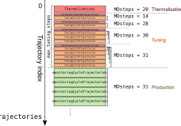

# Acceptance Rate Tuning

## Introduction

Frequently when running simulations with the HMC the
tuning the Molecular Dynamics (MD) parameters are
non-trivial to tune.

In order to circumvent this issue `hmcdj` has a built-in
acceptance rate tuning functionality.

Built on the assumption that the user specifies the
trajectory length `trajL`, the code adapts the number
of molecular dynamics steps `MDsteps`.

Management of the acceptance rate takes place in three
distinct phases:

- Thermalisation
- Tuning
- Production/Monitoring

## Initialisation phase

When the ensemble begins, a short period with no accept/reject
step takes place. Here the acceptance rate is not monitored.
The number of trajectories corresponding to this is given by the
`Thermalisation` in the track.

## Tuning Phase

The acceptance rate is also not monitored for a short period after
the accept/reject step is activated,
and after any change to `MDsteps`.
This is to further thermalise the chain,
using the provided `MDsteps` in the track as the initial guess.
The number of trajectories in this period is given by `rethermalisationTrajectories`.

Following this, the HMC is run repeatedly for `tuningCycleTrajectories`
trajectories. The acceptance of each step is saved and then used to estimate
the acceptance rate.

If the acceptance rate is not within `deltaTargetAcceptance` of the
`targetAcceptance` then `MDsteps` will be tuned.

In order to find the optimal number of `MDsteps`, the
formula for the integration step

$$
\Delta\tau =
\frac{\mathrm{trajL}}{\mathrm{MDsteps}}
$$

as a function of the acceptance rate is used:

$$
P_{acc} = \mathrm{erfc}(
          \lambda \frac{(\Delta\tau)^2}{2}).
$$

Provided a target acceptance rate, `MDsteps` is
adjusted to obtain the desired step size.
This is implented by measuring the acceptance rate
and estimating the value of the constant $\lambda$.

If the target acceptace rate is reached,
the process will continue running without changing the MDsteps,
and use the increased statistics to confirm more precisely
that the acceptance rate is inside the desired interval.

This process is run for `maxTuningTrajectories`,
at which point hmcdj switches to monitoring the acceptance,
and reporting an error if it is outside the desired window.

## Monitoring Phase

After the tuning has been completed,
`hmcdj` will monitor the acceptance rate in real time,
raising an error if it leaves the desired range.

## Output file

hmcdj records the Metropolis result for each trajectory in
the file `acceptance.xml` in the ensemble directory.
This also stores a history of each change made to `MDsteps`,
so that it may go back and compute
the acceptance since the start of the most recent step.
